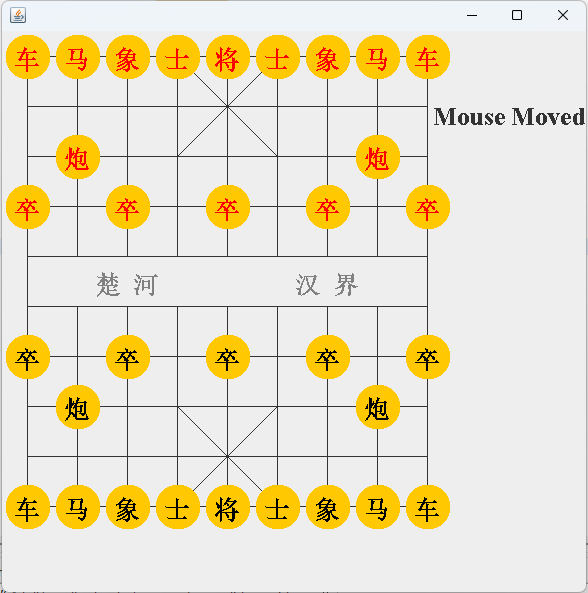
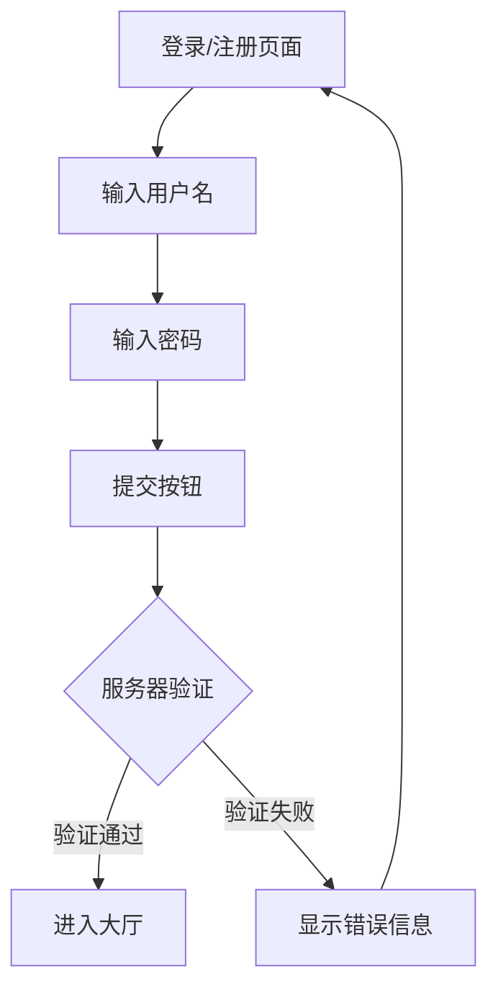
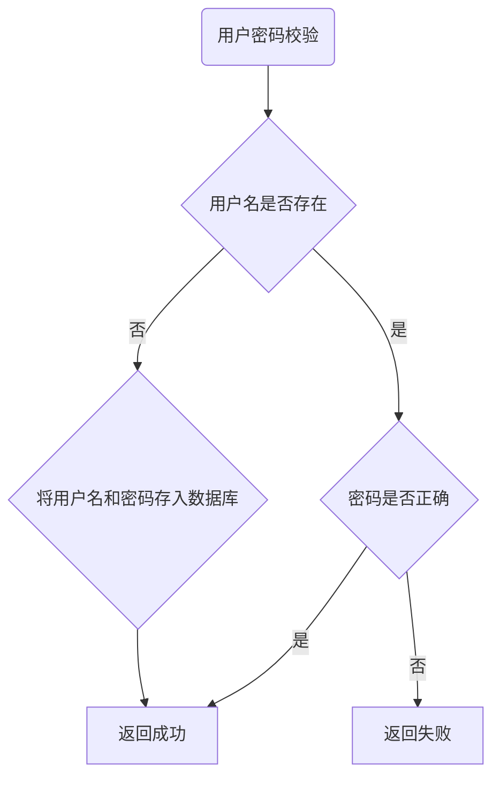

# 简介
java练习-中国象棋小游戏  
利用awt和swing库绘制界面，使用鼠标操作对战   
  

https://www.xqbase.com/protocol/cchess_move.htm

一般软件有2种显示方式，
1. 单击后显示可能的落点，再次单击落点移动，并用方框标记移动的起点和终点，若未点击可能落点，取消
2. 拖动，鼠标切换，也显示可能的落点，若放下位置不符合，取消，符合，落下，标记起点和终点
第一种简单点，先实现第一种。

Jpanel是从左上角作原点，
0 1 2 3 4 5 6 7 8 x
1
2
3
4
5
6
7
8
9
y

抬起棋子的时候，在可能的落点画小圈提示
落下的时候，判断如果不在可能的落点，取消抬起

可能的落点：
1. 移动符合规则
2. 异色子

##数据结构
###棋子
颜色：红黑
类型：车马炮
选中：是否
吃掉：是否（否就不显示）
位置：横，纵

###全局
激活方：红/黑
状态：待选，选中，
起点，终点
可能的落点
游戏状态：进行中，结束

##主要的处理流程
###显示
画棋盘
画棋子
画可能的落点
画移动

###单击
待选状态，如果选中了对应方的棋子，计算可能的落点加入列表
选中状态，如果单击了可能的落点，如果有对方的子，标记吃掉，如果是将，标记结束，激活方改为另一方。


# 联机
2个窗口，分别作为server，显示自己的端口，可以输入对方的ip和端口，
将


## 登录或注册页面
如果用户注册过，检查密码通过，则进入大厅   
如果没有注册过，直接保存密码，进入大厅




## 大厅页面
大厅主要是为了创建房间和等待邀请
如果收到邀请，弹出邀请界面，如果确认，进入房间
点击创建房间，进入房间
点击加入游戏，随机进入空闲房间

## 房间页面
显示双方准备状态
如果双方都准备好，进入对战界面

## 对战界面
单击发送位置到服务器
服务器转发到对方
对方如果读取服务器发送的位置，更新显示

## 消息设计
消息类型：登录
用户名：
密码：

type
Login Username Password


# 参考
如何用面向对象设计一个程序，经典推荐？ - rufeng2000的回答 - 知乎
https://www.zhihu.com/question/36113705/answer/2405176382


```uml
@startuml
(*) --> "移动"
    --> "鼠标单击"
if "是否有棋子抬起" then
  -->[false] "棋子状态切成抬起"
  --> "棋子位置为鼠标位置"
else
  -->[true] if "是否能落下" then
            -->[true] "棋子状态切为落下"
            --> "棋子位置改为落点位置"
     endif


endif
@enduml

```
File -> Import -> Maven -> Existing Maven Project -> Browser -> Select ChineseChess Folder -> Finish
On Left Package Explorer Panel -> Right Click On this package -> Maven -> Update Project
然后就可以运行了

ubuntu 
1. 要安装maven和openjdk
sudo apt install maven openjdk-11-jdk
2. 设置eclipse源
Eclipse -> Window -> Preferences -> Install/Update -> Available Software Sites
https://mirrors.ustc.edu.cn/eclipse/releases/2023-09
http://mirrors.ustc.edu.cn/eclipse/releases/2023-09/202309131000/
3. 设置maven源
create ~/.m2/settings.xml
```xml
<settings>
    <mirrors>
        <mirror>
            <id>aliyun</id>
            <name>aliyun</name>
            <mirrorOf>central</mirrorOf>
            <!-- 国内推荐阿里云的Maven镜像 -->
            <url>https://maven.aliyun.com/repository/central</url>
        </mirror>
    </mirrors>
</settings>
```

